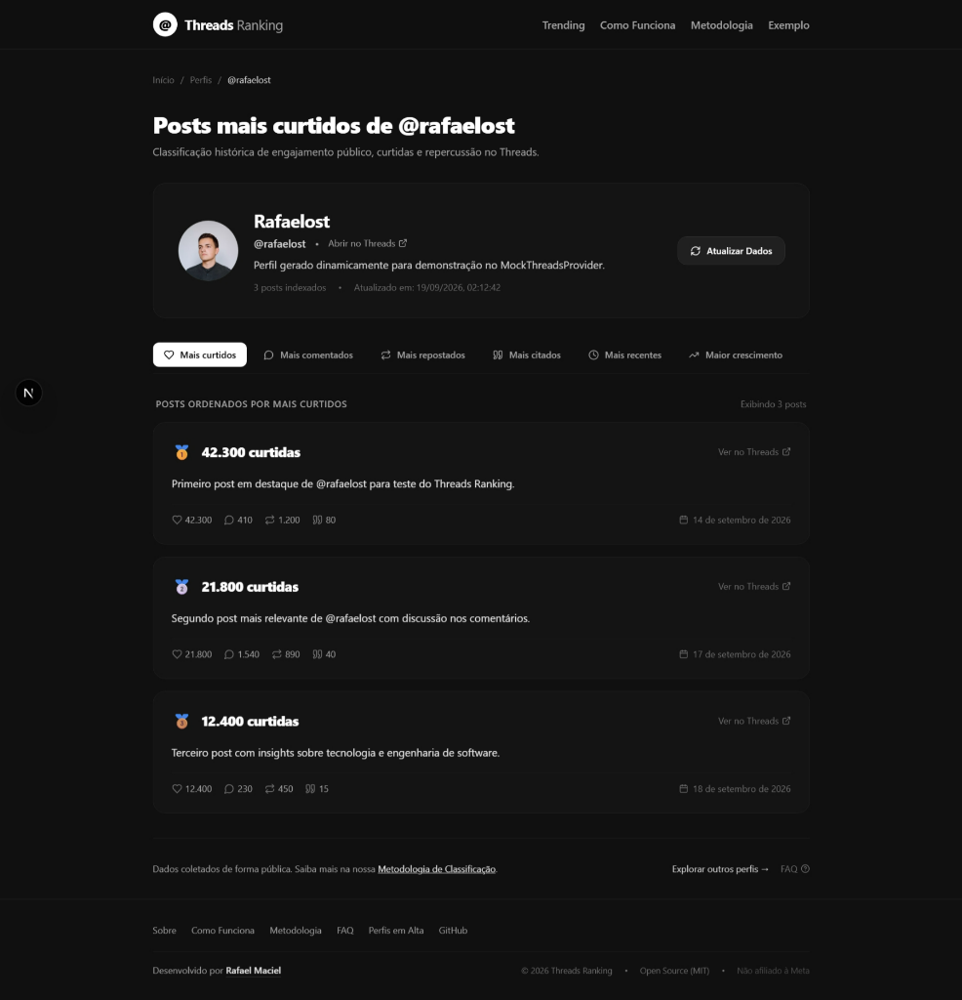
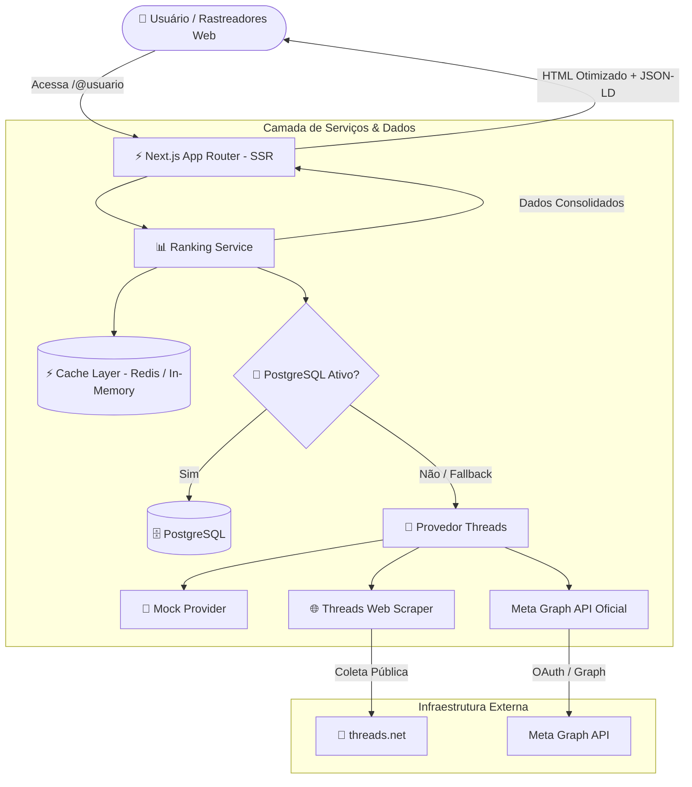

<div align="center">

# 🧵 Threads Ranking

**Descubra e acompanhe as publicações mais relevantes, virais e engajadas de perfis públicos no Threads.**

[](https://nextjs.org/)
[](https://www.typescriptlang.org/)
[](https://tailwindcss.com/)
[](https://www.postgresql.org/)
[](https://redis.io/)
[](https://www.docker.com/)
[](https://github.com/rafaelmaciels/threads-ranking/actions/workflows/ci.yml)
[](LICENSE)

[Visualizar Demonstração](#-modo-demo-desenvolvimento-offline) • [Documentação da Arquitetura](#-arquitetura) • [Como Contribuir](CONTRIBUTING.md)

</div>

---

## 📸 Preview da Aplicação

<div align="center">
  
</div>

---

## 💡 Sobre o Projeto

Inspirado no clássico conceito do *Favstar* e voltado para a comunidade do Threads da Meta, o **Threads Ranking** é uma plataforma de classificação e análise de engajamento público. O sistema permite pesquisar qualquer conta pública do Threads e descobrir imediatamente quais são suas postagens históricas recordistas em curtidas, comentários, compartilhamentos e citações.

### ✨ Principais Recursos

- 🔍 **Pesquisa Instantânea:** Consulta direta de qualquer perfil pelo identificador `@usuario`.
- 🥇 **Rankings Multimétricas:**
  - **Mais curtidos:** Postagens recordistas com maior volume de curtidas.
  - **Mais comentados:** Discussões com maior engajamento e respostas do público.
  - **Mais repostados:** Publicações mais compartilhadas pela comunidade.
  - **Mais citados:** Postagens mais citadas em outros tópicos.
  - **Mais recentes:** Linha do tempo cronológica com publicações recém-postadas.
  - **Maior crescimento:** Algoritmo de velocidade de engajamento acumulado por hora (*Growth Rate*).
- 👤 **Metadados Oficiais do Threads:** Captura nativa da biografia autêntica do Threads, contagem real de seguidores da rede e fotos em alta definição (sem conflitos com a conta do Instagram).
- 🛡️ **Detector de Plágio "Anti Kibe":** Comparador inteligente de postagens de perfis diferentes para identificar indícios de cópia descarada, paráfrases e conferir a linha do tempo exata de quem publicou primeiro (com N-gramas, Jaccard, Levenshtein e Kibe Score de 0 a 100%).
- 🛡️ **Resiliência & Circuit Breaker:** Arquitetura desacoplada com fallback inteligente em memória e cache Redis, permitindo respostas em milissegundos mesmo se o banco local estiver inativo.
- 🖼️ **Proxy de Mídia de Primeira Parte:** Entrega avatares oficiais da CDN da Meta sem falhas de CORS ou restrições de cabeçalho `Referer`.
- 🌐 **Arquitetura SEO de Alta Performance:** Renderização Server-Side (SSR) completa, metadados dinâmicos, dados estruturados Schema.org (JSON-LD), sitemap XML dinâmico e prevenção estrita de *Soft 404*.

---

## 🏗️ Arquitetura

O sistema adota uma arquitetura limpa e modular baseada no Next.js App Router, com camadas bem definidas de provedores de dados, cache com invalidação inteligente e serviços de ranking:



---

## 🚀 Quick Start

### Pré-requisitos
- **Node.js**: versão 20.x ou 22.x LTS
- **npm**: versão 10.x ou superior
- **Git**

### Passo a Passo

1. **Clone o repositório:**
   ```bash
   git clone https://github.com/rafaelmaciels/threads-ranking.git
   cd threads-ranking
   ```

2. **Instale as dependências:**
   ```bash
   npm install
   ```

3. **Configure as variáveis de ambiente:**
   ```bash
   cp .env.example .env.local
   ```

4. **Gere os tipos do Prisma Client:**
   ```bash
   npx prisma generate
   ```

5. **Inicie o servidor de desenvolvimento:**
   ```bash
   npm run dev
   ```
   Abra [http://localhost:3000](http://localhost:3000) no seu navegador.

---

## 🐳 Executando com Docker

O projeto inclui um arquivo `docker-compose.yml` pré-configurado com instâncias do **PostgreSQL 16** e **Redis Alpine**:

```bash
# Inicie o banco de dados e o cache em background:
docker compose up -d

# Execute as migrações do banco:
npx prisma db push

# Inicie o servidor da aplicação:
npm run dev
```

---

## 🧪 Modo Demo (Desenvolvimento Offline)

Para facilitar o desenvolvimento, demonstrações e testes sem necessidade imediata de credenciais externas ou banco de dados, o projeto possui um **Mock Provider** completo integrado:

No arquivo `.env.local`:
```env
THREADS_PROVIDER=mock
```

Com esta configuração, o sistema carrega perfis e rankings instantâneos (como `@demo` e `@zuck`), com dados simulados consistentes para desenvolvimento de interface e testes.

---

## 🔌 Provedores e Configuração de APIs

O Threads Ranking suporta múltiplos provedores através da interface unificada `ThreadsDataProvider`:

| Provedor | Variável (`THREADS_PROVIDER`) | Descrição |
| :--- | :--- | :--- |
| **Mock** | `mock` | Ideal para testes rápidos locais e desenvolvimento de interface. |
| **External / Direct** | `external` | Consulta direta da web pública do Threads com dados 100% autênticos. |
| **Oficial Graph API** | `official` | Integração via Meta for Developers utilizando OAuth e tokens de acesso oficiais. |

> [!CAUTION]
> **Segurança em Primeiro Lugar:** Nunca submeta arquivos com credenciais reais (`.env`, `.env.local`, chaves de API, `CLIENT_SECRET` ou senhas de banco) para o controle de versão. O arquivo `.env.example` serve exclusivamente como molde de configuração sanitizado.

---

## 🎯 Arquitetura SEO

O projeto foi construído seguindo rigorosamente as diretrizes dos motores de busca para rastreabilidade e indexação de páginas públicas úteis:

- **Server-Side Rendering (SSR):** As páginas de perfil (`/@usuario`) entregam o conteúdo consolidado e rankings no primeiro pacote HTTP, permitindo indexação completa mesmo por rastreadores que não executam JavaScript.
- **Canonicals Estritas:** Eliminação de páginas duplicadas via tags `<link rel="canonical">` apontando para a rota limpa canônica.
- **Tratamento de 404 Real:** Perfis inexistentes acionam `notFound()`, entregando status HTTP `404 Not Found` genuíno e cabeçalho `noindex, nofollow`, prevenindo incidentes de *Soft 404*.
- **Controle de Thin Content:** Contas recém-criadas ou sem publicações indexadas recebem automaticamente diretiva `noindex`, protegendo a reputação do domínio.
- **Dados Estruturados (JSON-LD):** Esquemas Schema.org tipados incluindo `WebSite`, `ProfilePage`, `Person`, `SocialMediaPosting`, `BreadcrumbList` e `FAQPage`.
- **Páginas Editoriais Institucionais:** `/sobre`, `/como-funciona`, `/metodologia`, `/faq` e hub de perfis em `/trending`.
- **Google Analytics 4:** Coleta de eventos customizados (`search_profile`, `view_profile`, `ranking_filter`, `view_post`) via `NEXT_PUBLIC_GA_MEASUREMENT_ID`.

---

## 🗺️ Roadmap

- [x] Pesquisa de perfis públicos do Threads
- [x] Ranking por mais curtidos (*Likes*)
- [x] Ranking por mais comentados (*Replies*)
- [x] Ranking por mais repostados (*Reposts*)
- [x] Ranking por mais citados (*Quotes*)
- [x] Linha do tempo recente (*Recent*)
- [x] Ranking de velocidade de crescimento (*Growth Rate*)
- [x] Coleta oficial de metadados nativos do Threads (Bio, Seguidores, Foto HD)
- [x] Cache multinível com Redis e Circuit Breaker em memória
- [x] Proxy seguro de primeira parte para imagens de avatar
- [x] Arquitetura SEO completa com SSR, JSON-LD, Sitemap e Robots
- [x] Suíte de 31 testes unitários automatizados com Vitest
- [x] Hub de perfis em destaque (`/trending`)
- [x] **Detector de Plágio "Anti Kibe"** (`/anti-kibe`) — Comparador de posts com N-gramas (Jaccard), Levenshtein, delta temporal e Kibe Score
- [ ] Exportação de rankings em formato CSV e JSON
- [ ] Notificações de novos recordes de engajamento

---

## 🛡️ Funcionalidade Implantada: Detector de Plágio "Anti Kibe"

> [!NOTE]
> **Status:** ✅ **Implantada e 100% operacional**. Disponível visualmente na rota [`/anti-kibe`](/anti-kibe) e programaticamente através da API REST em `POST /api/anti-kibe`.

A funcionalidade **Anti Kibe** identifica situações onde determinado conteúdo textual público foi reproduzido, parafraseado ou copiado por outro perfil, oferecendo transparência sobre a autoria primária e a cronologia exata de quem publicou primeiro.

```text
@autor_original ────► Postagem em 19/09/2026 03:14: "PASSOU DA MEIA-NOITE. É PULSO ÚNICO..."
                              │
                    [Motor Algorítmico Anti Kibe]
                    • Jaccard com N-Gramas (Bi/Trigramas)
                    • Distância de Levenshtein Normalizada
                    • Análise Temporal (Δt) e Estrutural
                              ▼
@segundo_usuario ───► Postagem em 20/09/2026 14:20: "Passou da meia-noite galera! É pulso único..."
                      Kibe Score: 85% • Veredito: 🚨 KIBE CONFIRMADO (35.1h depois)
```

### Pilares e Métricas de Avaliação:
1. **Autoria Primária & Cronologia ($\Delta t$):** Analisa as datas de publicação (`publishedAt`) de ambos os posts para definir o autor original e apontar quem veio depois e com quantas horas de diferença.
2. **N-Gramas de Palavras (Jaccard):** Identifica a reprodução exata de sequências contínuas de 2 e 3 palavras.
3. **Distância de Levenshtein:** Detecta substituições sutis de palavras, gírias e pontuações feitas pelo "kibador".
4. **Isolamento de Trechos Idênticos:** Extrai automaticamente as frases idênticas compartilhadas para realce visual e cópia rápida.
5. **Classificação & Veredito:**
   - **80% a 100%:** `🚨 Kibe Confirmado` (Cópia quase idêntica / plágio descarado)
   - **60% a 79%:** `⚠️ Suspeita Elevada` (Paráfrase ou estrutura copiada)
   - **30% a 59%:** `💡 Inspiração Provável` (Mesmo assunto com palavras próprias)
   - **0% a 29%:** `✅ Original` (Publicações com construções totalmente distintas)

---

## 🧪 Testes Automatizados

O projeto conta com testes unitários cobrindo validação de nomes de usuário, cálculos de velocidade de crescimento, algoritmos de ordenação e integridade da arquitetura SEO:

```bash
# Executar todos os testes:
npm test

# Executar em modo interativo / watch:
npm run test:watch

# Checagem estrita de tipagem TypeScript:
npm run type-check
```

---

## 🤝 Como Contribuir

Contribuições da comunidade são muito bem-vindas! Por favor, consulte nosso [Guia de Contribuição](CONTRIBUTING.md) para detalhes sobre convenções de código, branches e envio de Pull Requests.

---

## 📄 Licença

Este projeto é software livre sob os termos da licença [MIT](LICENSE).

---

<div align="center">

Desenvolvido por [Rafael Maciel](https://rafaelmaciel.net/)

</div>
